# 🌿 MoodScape — Mental Wellness Android App

A mood-tracking Android app that helps users log emotions, journal, self-assess, and visualize emotional patterns over time — built as a final-year BCA project.


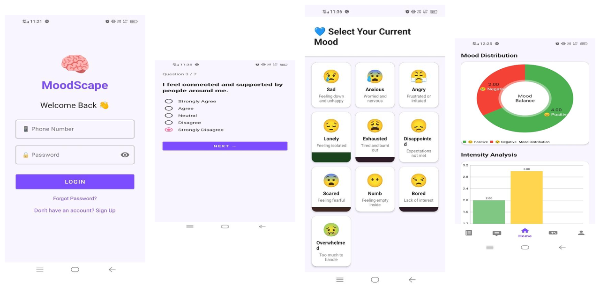

## ✨ Features

- 🔐 **Secure login & signup** with local credential storage
- 😊 **Mood selection & tracking** across 8+ emotional states, with intensity, triggers, and notes
- 📝 **Self-assessment** — a 7-question check-in that scores overall emotional state
- 💡 **Personalized suggestions** — curated songs, readings, and activities based on current mood
- 📖 **Daily diary** with emotion tagging, organized by calendar date
- 🤖 **MoodBot** — an in-app conversational assistant for emotional support
- 🎯 **Wellness activities** — breathing exercises, gratitude prompts, and mini-games that build a mood score
- 📊 **Visual insights** — mood distribution and intensity charts to spot patterns over time
- 👤 **Profile & settings** — dark mode, password change, privacy policy, data stored entirely on-device

## 📱 Screenshots

| Login | Home | Mood Selection |
|---|---|---|
| 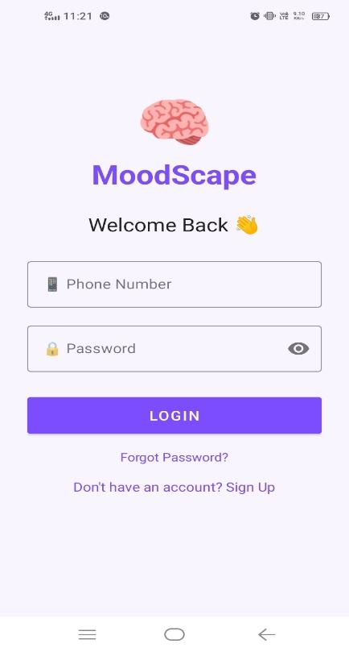 | 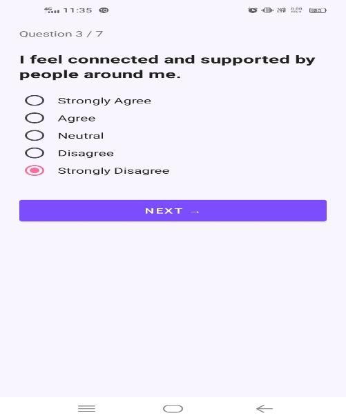 | 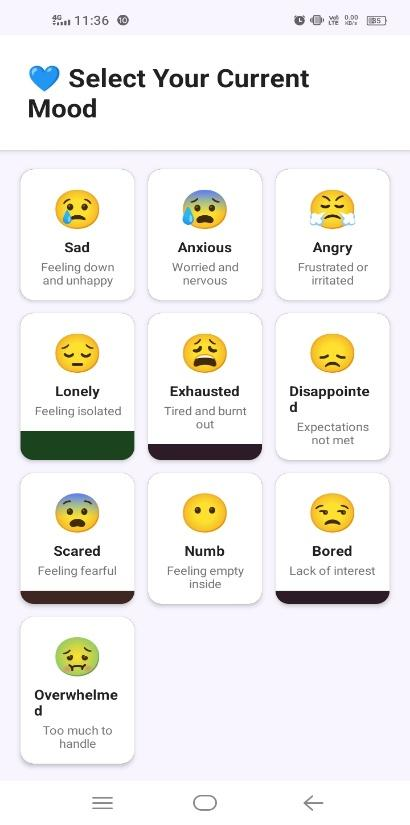 |

| Self-Assessment | Suggestions | Mood History |
|---|---|---|
| 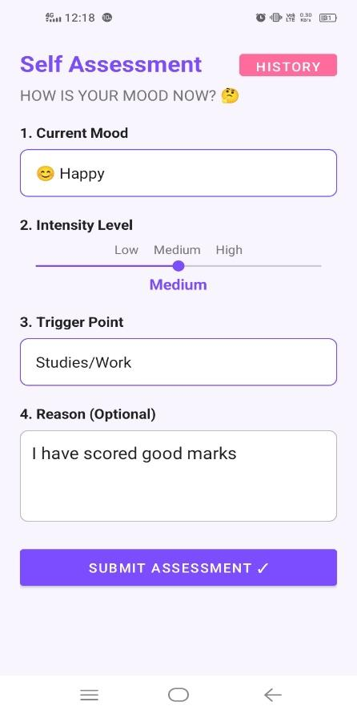 | 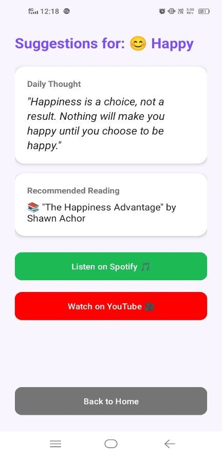 | 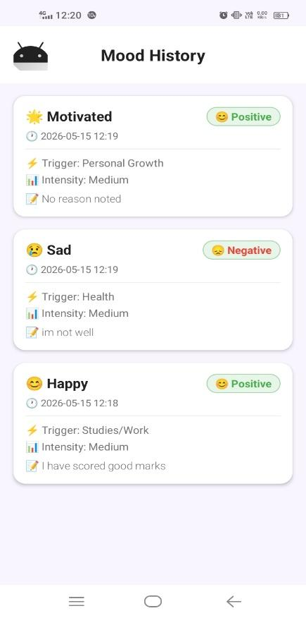 |

| Visual Insights | Diary | Chat |
|---|---|---|
| 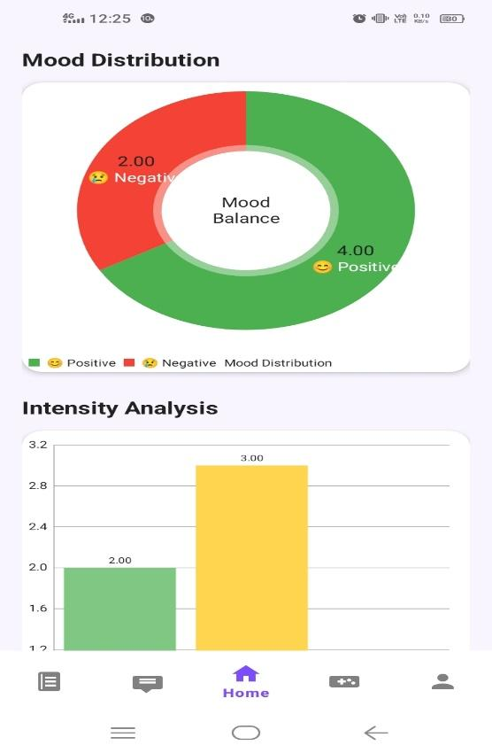 | 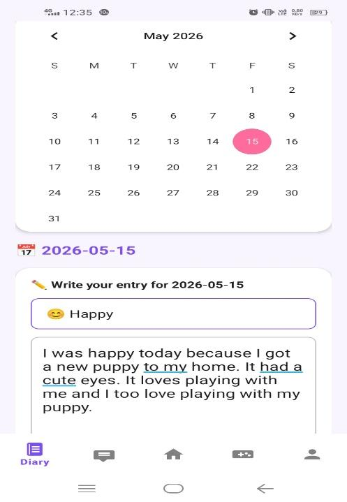 | 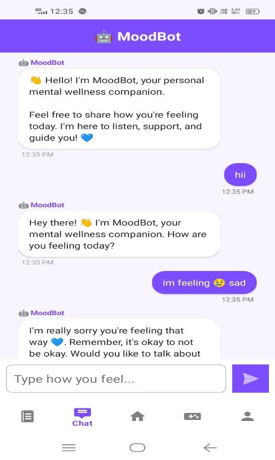 |

| Activities | Profile | Settings |
|---|---|---|
| 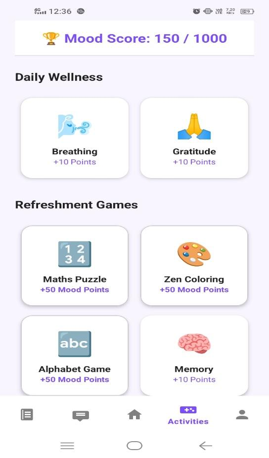 | 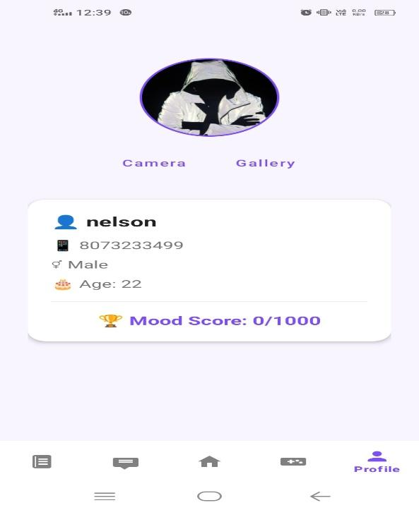 | 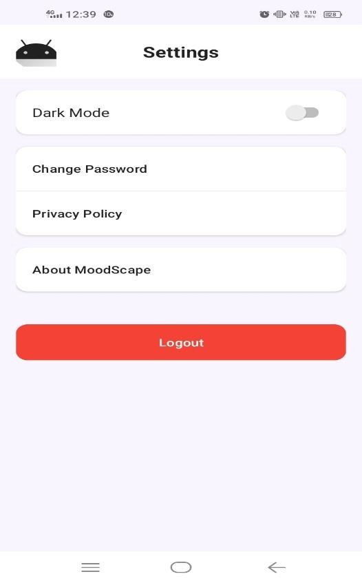 |

## 🛠️ Tech Stack

- **Language:** Java
- **Local Database:** SQLite — hand-rolled `DatabaseHelper` (`SQLiteOpenHelper`), no ORM. All CRUD written manually with `ContentValues`, `Cursor`, and raw SQL.
- **Cloud:** Firebase Authentication + Firestore
- **Charts:** MPAndroidChart (mood distribution & intensity visualizations)
- **Animations:** Lottie
- **Image loading:** Glide · **Profile photo UI:** CircleImageView
- **Data export:** OpenCSV
- **Architecture:** Activity/Fragment-based, with `SessionManager` for session, theme, and mood-score state
- **Navigation:** Bottom navigation + Fragment transactions

## 🏗️ Architecture

```
UI (Activities / Fragments)
        │
        ▼
SessionManager (SharedPreferences: session, theme, mood score)
        │
        ▼
DatabaseHelper (SQLiteOpenHelper) ──── Firebase Auth / Firestore (cloud)
        │
        ▼
SQLite — users | mood_history | diary
```

## 🗄️ Database Schema

| Table | Key Fields |
|---|---|
| `users` | id, name, gender, age, phone (unique), password, profile_pic |
| `mood_history` | id, phone (FK), mood, intensity, trigger_point, reason, date_time, is_positive |
| `diary` | id, phone (FK), date, content, emotion |

## 🚀 Getting Started

```bash
git clone https://github.com/josephdravid/moodscape.git
```

1. Open the project in Android Studio (Hedgehog or newer)
2. Let Gradle sync
3. Run on an emulator or physical device (minSdk 26 / Android 8.0+)

## 📦 Download

📱 [Download APK](../../releases/latest) — grab the latest build from the Releases tab

## 🧪 Testing

The app was validated with unit, integration, and UI/UX test suites covering registration, login, mood logging, diary persistence, offline behavior, and navigation — all passing. Full test cases are documented in the project report.

## 🔭 What I'd Improve Next

- Migrate to Kotlin
- Move from SQLite to Room for compile-time query safety
- Add cloud backup/sync (optional, privacy-preserving)
- Export mood history as PDF/CSV
- Add push notification reminders for daily check-ins

## 👥 Team

Built by **Joseph Dravid A** and **Anthony Nelson**, BCA VI Semester, St. Francis College, Bengaluru — under the guidance of Ms. Bhavya C, Dept. of Computer Applications.

## 📄 License

MIT
